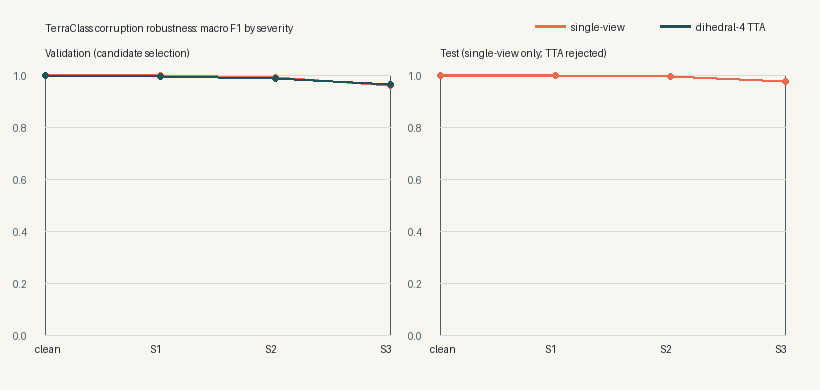

# Corruption Robustness and Test-Time Augmentation

## Outcome

The robustness phase scheduled for 20 July 2026 was completed early on 18 July 2026. It evaluates
the released ResNet18 model against deterministic synthetic image corruptions and tests one
validation-selected inference candidate. It does not retrain the model, change the IIT Kanpur
notebook, or change the production serving policy.

The single-view model retained a mean macro F1 of **0.991879** across the 15 corrupted test
conditions. The most difficult condition was Gaussian blur at severity 3 (radius 2.4), where macro
F1 was **0.918319** and accuracy was 0.920000. These results cover 75 test images from the balanced
five-class UC Merced subset; they are not a claim about all satellite imagery or real production
traffic.

Four-view dihedral test-time augmentation (TTA) was evaluated as a candidate on validation only. It
kept clean accuracy and macro F1 at 1.000 and improved the validation worst case, but reduced mean
corruption macro F1 from **0.986390** to **0.985616**. That missed the predeclared 0.005 minimum
improvement, so TTA was rejected before candidate test metrics were opened. The test report therefore
contains the single-view baseline only.

## Evaluation protocol

The protocol uses the checksum-verified group-aware manifest and serving artifact. Validation is
reserved for candidate selection, and the test split is opened only after that decision. Each split
contains 75 images and is evaluated under one clean condition plus five corruption families at
three severities:

| Corruption family | Severity 1 | Severity 2 | Severity 3 |
|---|---:|---:|---:|
| Brightness factor | 0.85 | 0.65 | 0.45 |
| Contrast factor | 0.80 | 0.60 | 0.40 |
| Gaussian blur radius | 0.8 | 1.6 | 2.4 |
| Gaussian-noise standard deviation | 0.02 | 0.05 | 0.10 |
| JPEG quality | 70 | 40 | 15 |

Gaussian noise is seeded from the image identity, severity, and fixed experiment seed, making every
corrupted image deterministic. The benchmark records accuracy, macro F1, NLL, multiclass Brier
score, 10-bin ECE, confidence, worst condition, and local inference timing. Timing is point-in-time
local CPU evidence and is not a production latency claim.

The corruption design follows the benchmark principle introduced by
[Hendrycks and Dietterich](https://arxiv.org/abs/1903.12261): evaluate a fixed classifier under
systematic, label-preserving perturbations. The TTA candidate averages logits from the identity,
horizontal flip, vertical flip, and 180-degree rotation. The
[TTA aggregation study by Shanmugam et al.](https://openaccess.thecvf.com/content/ICCV2021/papers/Shanmugam_Better_Aggregation_in_Test-Time_Augmentation_ICCV_2021_paper.pdf)
shows why transform composition and aggregation should be evaluated rather than assumed to help.

## Verified test evidence

The single-view test result is:

| View | Accuracy | Macro F1 |
|---|---:|---:|
| Clean | 1.000000 | 1.000000 |
| Mean across 15 corruptions | 0.992000 | 0.991879 |
| Severity 1 mean | 1.000000 | 1.000000 |
| Severity 2 mean | 0.997333 | 0.997330 |
| Severity 3 mean | 0.978667 | 0.978307 |
| Worst condition: blur radius 2.4 | 0.920000 | 0.918319 |

Across corruption families, the mean macro F1 values are 1.000000 for brightness, 1.000000 for
contrast, 0.968324 for blur, 0.991071 for noise, and 1.000000 for JPEG compression.



## Decision and claim boundary

The rejected TTA candidate is not part of the API or production model. No candidate test score is
reported, because running it after validation rejection would weaken the selection boundary. The
original single-view softmax and ResNet18 serving artifact remain unchanged.

This benchmark is intentionally narrower than a production robustness claim:

- the corruptions are synthetic and have not been shown to represent production traffic;
- each split contains only 75 images across five visually distinct classes;
- the experiment does not evaluate adversarial attacks;
- the experiment does not use RESISC45 or alter its licensing boundary; and
- robustness to these corruptions does not establish OOD detection, geographic transfer, or
  seasonal generalization.

## Reproduce the evidence

After restoring the UC Merced dataset and hash-verified serving artifact, run:

```bash
PYTHONPATH=src python -m scripts.evaluate_robustness \
  --project-root . \
  --device cpu
```

The command verifies the manifest image hashes, evaluates validation before test, writes
`reports/robustness_evaluation_2026-07-18.json`, and regenerates the versioned PNG figure. The
configuration in `configs/evaluation/robustness_v1.json` fixes all corruptions, severities, seeds,
candidate transforms, selection thresholds, and promotion boundaries before execution.
