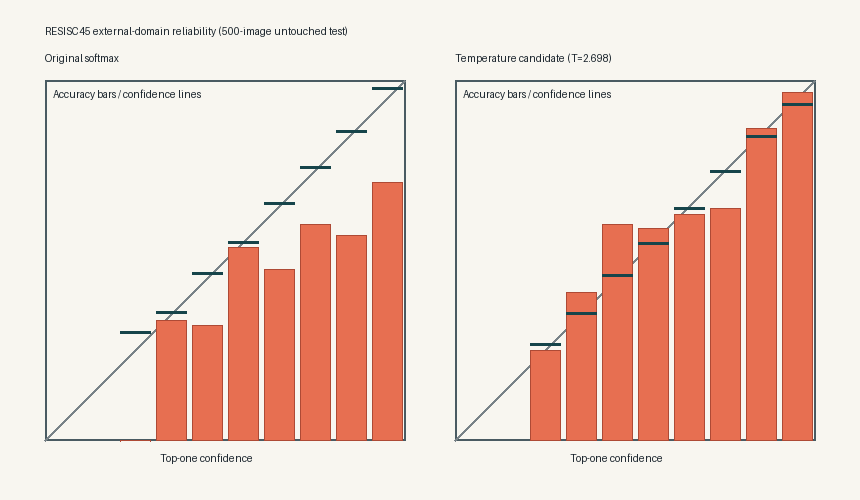

# External Calibration and OOD Evaluation

## Outcome

The 18 July follow-up fixes the *statistical identifiability* problem found in the original
75-image calibration attempt. It does not force a new temperature into production.

The evaluation uses NWPU-RESISC45 as an independent source domain. Its official validation split
provides 500 balanced calibration images, while its official test split provides a separate 500
balanced evaluation images. A further 5,457 test images from the 39 unmapped RESISC45 classes form
an OOD challenge set. No calibration image is reused for final evaluation.

The fitted temperature is **2.697718**, comfortably inside the configured `[0.05, 10.0]` bounds.
The 500-replicate stratified bootstrap has a 95% interval of **[2.485783, 2.908358]**, a relative
width of **0.156910**, and no bound hits. Across five stratified folds, the mean temperature is
2.697685 with a coefficient of variation of 0.014172; every fit remains inside the bounds and
improves holdout NLL.

This resolves the earlier unstable-fit diagnosis. It also reveals an important domain effect:
the external temperature improves RESISC45 calibration but damages the already sharp calibration
of the small UC Merced test set. The candidate is therefore recorded as external-domain evidence,
not deployed globally.

## Data roles and provenance

Four roles remain separate:

1. UC Merced training data fits the ResNet18 weights.
2. UC Merced validation data selected the checkpoint during the original experiment.
3. The RESISC45 official validation split fits the external temperature candidate.
4. The RESISC45 official test split evaluates calibration and OOD behavior without fitting.

The original RESISC45 benchmark contains 31,500 images in 45 classes. This repository pins the
427,389,445-byte redistributed archive and all three split-file SHA-256 values before use. The
redistributor labels the material **CC-BY-NC-4.0**, so it is used only for noncommercial evaluation
and is neither committed nor included in the production image.

The five-class correspondence is intentionally conservative:

| TerraClass class | RESISC45 source class |
|---|---|
| agricultural | circular farmland + rectangular farmland |
| airplane | airplane |
| baseball diamond | baseball diamond |
| beach | beach |
| buildings | commercial area |

The farmland merge and commercial-area proxy are published cross-domain correspondences, but they
are not exact semantic equivalence. Consequently, this experiment cannot prove that RESISC45 is
representative of future TerraClass production traffic.

## Untouched external test result

Temperature scaling changes probabilities, not the class ordering:

| Metric | Original softmax | Temperature 2.697718 |
|---|---:|---:|
| Accuracy | 0.624000 | 0.624000 |
| Macro F1 | 0.592231 | 0.592231 |
| Negative log-likelihood | 1.598340 | 1.083921 |
| Multiclass Brier score | 0.613252 | 0.540326 |
| 10-bin expected calibration error | 0.219989 | 0.066078 |
| Mean top-one confidence | 0.843989 | 0.597923 |

All three calibration metrics improve on the 500-image untouched external test set, while accuracy
and macro-F1 remain unchanged.



## Why production promotion is still rejected

On the original 75-image UC Merced group-aware test set, accuracy and macro-F1 remain 1.000, but NLL
worsens from **0.019747** to **0.234908**. That is a relative degradation of approximately 10.896,
far beyond the configured 0.25 limit. A single global temperature cannot be justified across these
two different domains.

Production promotion is also blocked because:

- RESISC45 has not been shown to match production traffic;
- the class mapping includes proxies;
- the redistributed data is marked noncommercial; and
- automatic calibration promotion is intentionally disabled.

The production model and IIT Kanpur notebook remain unchanged.

## OOD result

OOD detection is evaluated separately using all 39 unmapped RESISC45 test classes. Maximum softmax
probability is weak: after scaling, AUROC is **0.658873** and the false-positive rate at 95% true
positive rate is **0.866777**. Negative normalized entropy reaches AUROC **0.674375** with an
FPR95 of **0.833791**.

These values are evidence that scalar temperature scaling is not an adequate unfamiliar-scene
detector. They are not a production OOD claim. A later OOD phase should evaluate a dedicated
method against deployment-representative in-domain and out-of-domain samples.

## Reproduce the evidence

The external data is deliberately excluded from Git:

```bash
PYTHONPATH=src python -m scripts.download_resisc45 --project-root .
PYTHONPATH=src python -m scripts.evaluate_external_calibration --project-root . --device cpu
```

The first command verifies the archive, split files, row counts, safe paths, and extracted
31,500-image inventory. The second rebuilds the hash-bound manifest, performs real inference, runs
500 bootstrap fits and five-fold stability analysis, generates the reliability figure, and writes
`reports/external_calibration_evaluation_2026-07-18.json`.

## What would permit deployment

A deployable calibration parameter still requires owner-approved, production-representative labeled
data with its own calibration and untouched test roles. The same gates must pass on that domain:
an interior and stable temperature, narrow uncertainty, improved NLL/Brier/ECE, unchanged
classification metrics, and no unacceptable regression on established in-domain behavior.
