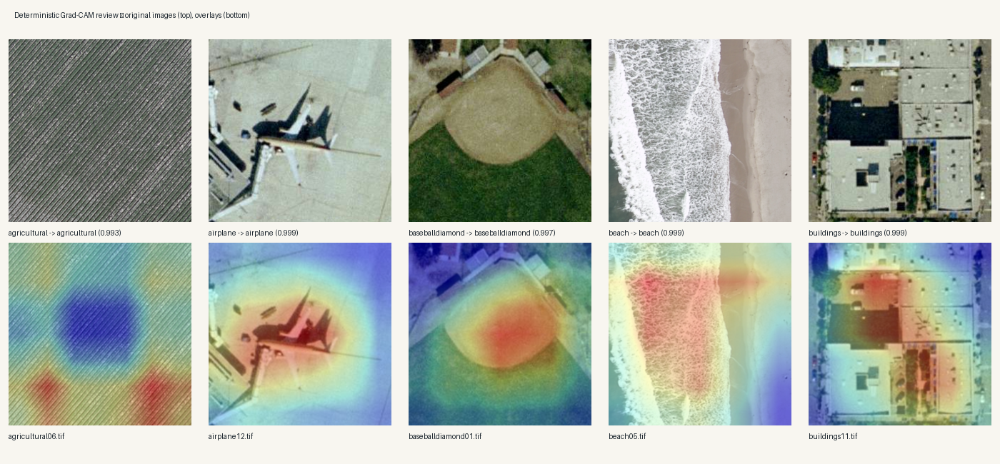
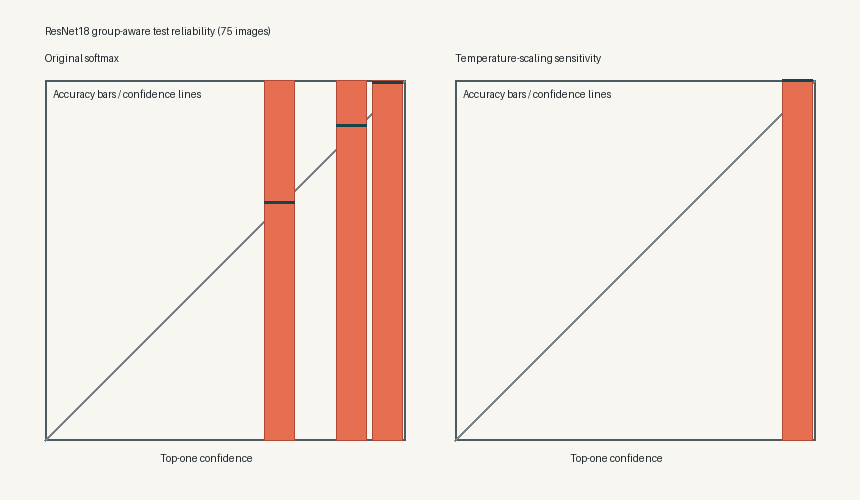

# Model Quality and Explainability Review

## Outcome

The scheduled 19 July phase was implemented and verified early on 17 July 2026. It evaluates the
selected ResNet18 checkpoint without retraining it, changing the IIT Kanpur submission, or changing
the production model. The phase adds three pieces of ML-quality evidence:

- validation-only scalar temperature fitting and an untouched test-set calibration review;
- confidence, normalized predictive entropy, and selective-risk summaries;
- deterministic Grad-CAM examples for all five classes.

The complete machine-readable result is
`reports/model_quality_evaluation_2026-07-17.json`. The implementation is in
`src/terraclass/model_quality.py`, and `configs/evaluation/model_quality_v1.json` fixes the protocol
before evaluation.

## Leakage-safe calibration protocol

The existing group-aware manifest remains the source of truth. Temperature fitting uses only its 75
validation images; the 75 test images remain untouched until evaluation. The report binds the run to
the exact manifest, serving artifact, source checkpoint, evaluation configuration, and generated
figure hashes.

The original test softmax produced:

| Metric | Result |
|---|---:|
| Accuracy | 1.000 |
| Macro F1 | 1.000 |
| Negative log-likelihood | 0.019747 |
| Multiclass Brier score | 0.005442 |
| 10-bin expected calibration error | 0.017477 |
| Mean top-one confidence | 0.982523 |
| Minimum top-one confidence | 0.639268 |
| Mean normalized predictive entropy | 0.042971 |

Temperature fitting reduced validation NLL from 0.036871 to 0.000009, but the fitted value reached
the configured lower bound of 0.05. All 75 validation samples were already classified correctly, so
the bounded optimizer kept sharpening the probabilities instead of identifying a stable interior
temperature. The apparently near-zero post-scaling test NLL and ECE are therefore recorded only as
a sensitivity result. They are not treated as evidence that 0.05 is a production-ready calibration
parameter.

The decision is to retain the original softmax. No calibrated artifact was promoted, and the
Cloud Run model remains unchanged. This is an intentional methodological refusal, not an incomplete
implementation.

## Selective prediction

The original softmax retained 60 of 75 test images at a confidence threshold of 0.99, giving 80%
coverage and zero observed selective risk on this small, perfectly classified test set. Lower
thresholds retained between 92% and 100% of the samples. These values describe only this 75-image
test set; they do not establish a safe production abstention threshold.

An operational threshold would require a larger, representative calibration set containing both
correct and incorrect predictions, followed by separate validation under deployment-like data.

## Deterministic Grad-CAM review

Grad-CAM targets `layer4[-1]` and the model-predicted class. To avoid choosing visually attractive
examples, the evaluator selects the lexicographically first test image in each class. The resulting
five examples are all correct, but the figure is qualitative evidence only:



The overlays show class-relevant spatial attention for the airplane, baseball diamond, beach, and
building examples. The agricultural example is more diffuse, which is useful review evidence rather
than something to hide. Grad-CAM does not prove causal reasoning, robustness, or generalization.

The reliability figure preserves the original softmax and the rejected temperature-scaling
sensitivity side by side:



## Reproduce the evidence

The dataset and hash-verified serving artifact are intentionally excluded from Git. After restoring
them according to the serving documentation, run:

```bash
PYTHONPATH=src python scripts/evaluate_model_quality.py \
  --project-root . \
  --device cpu
```

The command verifies every image hash in the group-aware manifest, fits temperature on validation
logits, evaluates the test logits, generates both figures, and writes the JSON report.

## Claim boundary

The evidence covers a balanced 500-image, five-class UC Merced subset. It does not turn the model
into a universal 21-class satellite classifier. The 75-image validation and test splits are too
small and too clean to establish general production calibration. Grad-CAM is a qualitative
localization aid, not a causal explanation. The submitted IIT notebook and deployed production
model were not modified.
